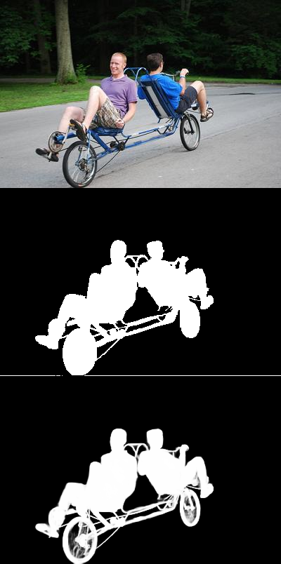
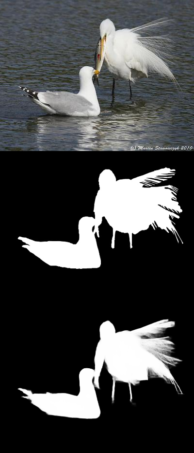
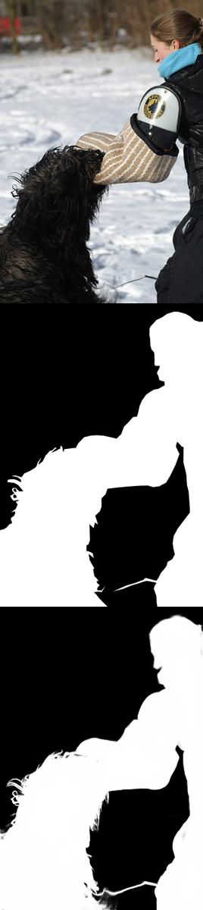
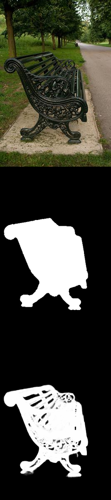
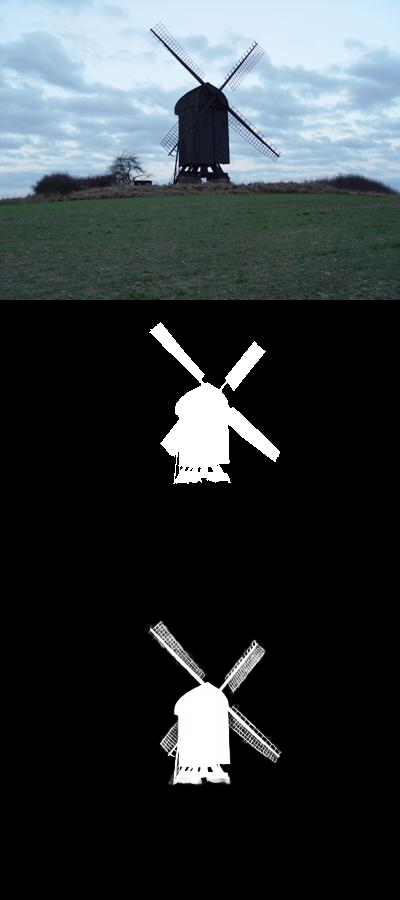
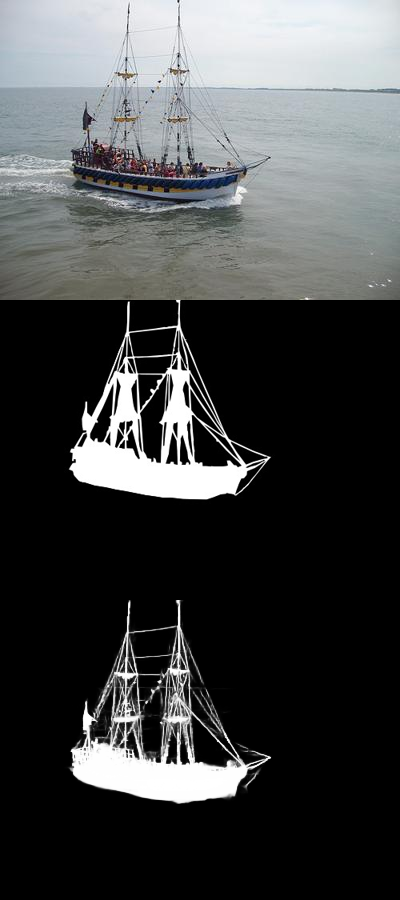
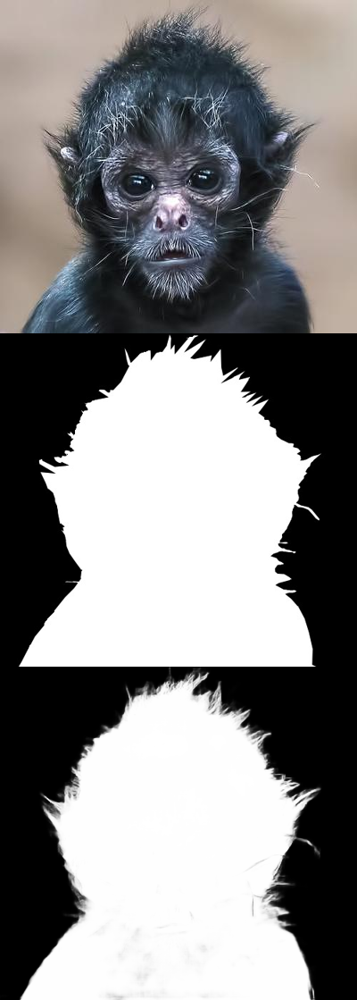
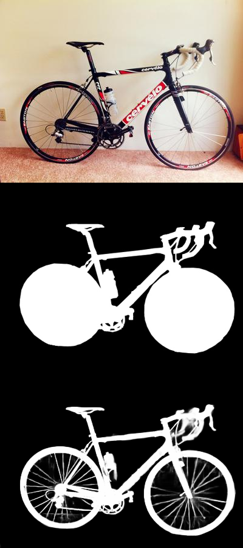
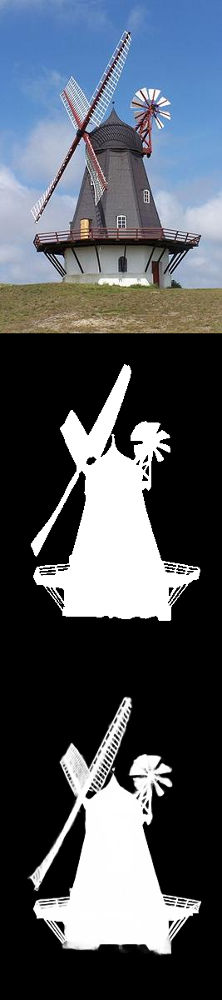
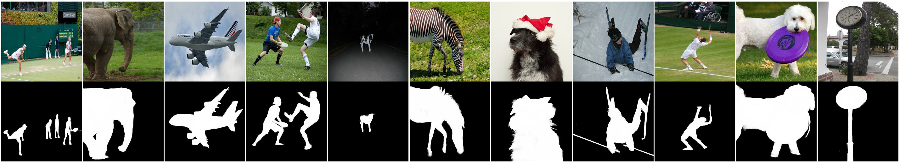

# SOD-diffusion
## Diffusion Model for Salient Object Detection

    

We present SOD-diffusion, a diffusion model and associated fine-tuning protocol for Salient Object Detection(SOD). Its core principle is to leverage the rich visual knowledge stored in modern generative image models. The first line represents the input image, the second line is its corresponding ground-truth mask, and the third line shows the saliency mask generated by our SOD-diffusion model. It can be observed that even though our model is trained on somewhat coarse SOD benchmark datasets, it is still capable of accurately segmenting the edges of salient objects, benefiting from powerful visual priors. The final salient object detection results are even finer and more accurate than the ground-truth mask.

    

Our model, derived from Stable Diffusion and fine-tuned with SOD benchmark data, can zero-shot transfer to unseen datasets, offering state-of-the-art salient Object detection results. Benefiting from this feature, we conducted inference on the COCO dataset, which has never been used for saliency detection before, and generated finely detailed saliency object masks, thus constructing a new SOD benchmark dataset. The first line represents the input image, and the second line shows the generated saliency object mask.

## Overview

Salient Object Detection (SOD) is a challenging task that aims to precisely identify and segment the salient objects. However, existing methods still face challenges in attaining explicit predictions near the edges or lack the capability for end-to-end training. To alleviate the problem, we propose SOD-diffusion, a new framework that formulates salient object detection as a denoising diffusion process from noisy masks to object masks. Specifically, object masks diffuse from ground-truth masks to random distribution in latent space, and the model learns to reverse this noising process to reconstruct object masks. To enhance the denoising learning process, we utilize a cross-attention mechanism to integrate conditional semantic features from the input image with diffusion noise embedding. Extensive experiments on five widely used SOD benchmark datasets demonstrate that our proposed SOD-diffusion achieves favorable performance compared to previous well-established methods. Besides, by leveraging the outstanding generalization capability of SOD-diffusion, we also applied SOD-diffusion on 2000 publicly available images, generating high-quality masks as an additional SOD benchmark dataset.

## Datasets
All datasets are available in public.
* Download the DUTS-TR and DUTS-TE from [Here](http://saliencydetection.net/duts/#org3aad434)
* Download the DUT-OMRON from [Here](http://saliencydetection.net/dut-omron/#org96c3bab)
* Download the HKU-IS from [Here](https://i.cs.hku.hk/~yzyu/research/deep_saliency.html)
* Download the ECSSD from [Here](https://www.cse.cuhk.edu.hk/leojia/projects/hsaliency/dataset.html)
* Download the PASCAL-S from [Here](http://cbs.ic.gatech.edu/salobj/)

## Requirements
* Python >= 3.8.x
* Pytorch >= 2.0.1
* diffusers >= 0.25.1
* pip install -r requirements.txt

## Run
* Run **train.sh** and **inference.sh** scripts.
<pre><code># For training SOD-diffusion
cd scripts
bash train.sh

# For inference SOD-diffusion  
cd scripts
bash inference.sh
</code></pre>

## Configurations
--pretrained_model_name_or_path: pretrained model path from hugging face or local dir.  
--swinb_model_path: pretrained swinb model.  
--train_img_list: img_list.txt, including the absolute path of all train images.  
--train_gt_list: gt_list.txt, including the absolute path all ground truth masks.  
--val_img: path of the validation set of images.  
--val_gt: path of the validation set of ground truth masks.

