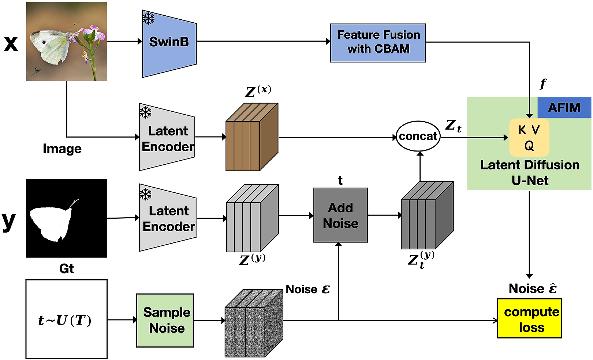
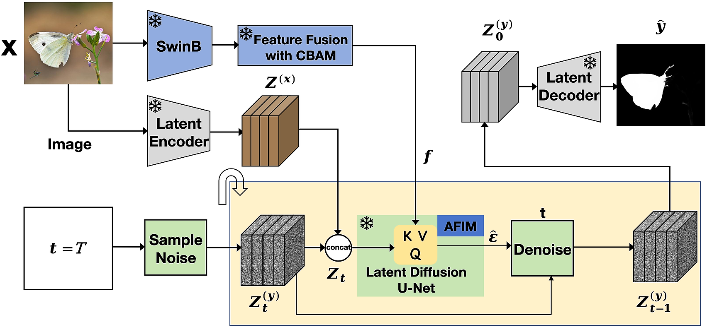

# SOD-diffusion
## Salient Object Detection via Diffusion-Based Image Generators


## 🪧 [Comprehensive supplements](https://github.com/QuantumScriptHub/SOD-diffusion/blob/master/result/SOD-diffusion_SUPP.pdf)
For a more comprehensive and detailed visual demonstration, please refer to our extensive [supplementary materials](https://github.com/QuantumScriptHub/SOD-diffusion/blob/master/result/SOD-diffusion_SUPP.pdf). Therein, you will find the additional implementation details and comparative experimental data.

<p align="center" style="margin: 0; padding: 0;">
    
</p>

<p align="justify">
We present SOD-diffusion, a diffusion model and associated fine-tuning protocol for Salient Object Detection(SOD). Its core principle is to leverage the rich visual knowledge stored in modern generative image models. The first line represents the input image, the second line is its corresponding ground-truth mask, and the third line shows the saliency mask generated by our SOD-diffusion model. It can be observed that even though our model is trained on somewhat coarse SOD benchmark datasets, it is still capable of accurately segmenting the edges of salient objects, benefiting from powerful visual priors. The final salient object detection results are even finer and more accurate than the ground-truth mask. 
</p>

More results can be viewed by clicking on [result](./result).
<p align="center">
    
</p>
<p align="justify">
Our model, derived from Stable Diffusion and fine-tuned with SOD benchmark data, can zero-shot transfer to unseen datasets, offering state-of-the-art salient Object detection results. Benefiting from this feature, we conducted inference on the COCO dataset, which has never been used for saliency detection before, and generated finely detailed saliency object masks, thus constructing a new SOD benchmark dataset. The first line represents the input image, and the second line shows the generated saliency object mask. 
</p>

The new [SOD benchmark dataset](https://drive.google.com/file/d/1X4hG1rxoUwxtWOhmEBJAf5FxIm_htmO1/view?usp=drive_link) can be downloaded via this [link](https://drive.google.com/file/d/1X4hG1rxoUwxtWOhmEBJAf5FxIm_htmO1/view?usp=drive_link).


##  📢 Overview

<p align="justify">
Salient Object Detection (SOD) is a challenging task that aims to precisely identify and segment the salient objects. However, existing SOD methods still face challenges in making explicit predictions near the edges and often lack end-to-end training capabilities. To alleviate these problems, we propose SOD-diffusion, a novel framework that formulates salient object detection as a denoising diffusion process from noisy masks to object masks. Specifically, object masks diffuse from ground-truth masks to random distribution in latent space, and the model learns to reverse this noising process to reconstruct object masks. To enhance the denoising learning process, we design an attention feature interaction module (AFIM) and a specific fine-tuning protocol to integrate conditional semantic features from the input image with diffusion noise embedding. Extensive experiments on five widely used SOD benchmark datasets demonstrate that our proposed SOD-diffusion achieves favorable performance compared to previous well-established methods. Furthermore, leveraging the outstanding generalization capability of SOD-diffusion, we applied it to publicly available images, generating high-quality masks that serve as an additional SOD benchmark testset.
</div>

<div style="display:flex; justify-content:space-between;">
    
    
</div>

The left image shows the training process, while the right one illustrates the inference process.

## ⬇ Datasets
**All datasets are available in public**.
* Download the DUTS-TR and DUTS-TE from [Here](http://saliencydetection.net/duts/#org3aad434)
* Download the DUT-OMRON from [Here](http://saliencydetection.net/dut-omron/#org96c3bab)
* Download the HKU-IS from [Here](https://i.cs.hku.hk/~yzyu/research/deep_saliency.html)
* Download the ECSSD from [Here](https://www.cse.cuhk.edu.hk/leojia/projects/hsaliency/dataset.html)
* Download the PASCAL-S from [Here](http://cbs.ic.gatech.edu/salobj/)
  
## 🛠️  Dependencies
```bash
* Python >= 3.8.x
* Pytorch >= 2.0.1
* diffusers >= 0.25.1
* pip install -r requirements.txt
```
## 📦 Checkpoint cache

By default, our [checkpoint](https://drive.google.com/file/d/1mZGZZzg1eWzv-U6jw8ILp9u8rGr4Bhxv/view) and [Our trained SwinB backbone](https://drive.google.com/file/d/1YK4h_jgQU-PuvgIvlle9JDonxND4uUeQ/view) are stored in Google Drive.
You can click the link to download them and proceed directly with inference.

## ⚙ Configurations

#### Training

- --pretrained_model_name_or_path : [Pretrained model](https://huggingface.co/stabilityai/stable-diffusion-2/tree/main) path for stable-diffusion-2 from hugging face, you need to download it and place it in a local directory.
- --swinb_model_path : [Pretrained Swinb backbone model](https://drive.google.com/file/d/1y4j7wYjQbImkZ5ENz2tcfIBu0JKlkZXl/view?usp=drive_link), you need to download it and place it in the corresponding local path.  
- --train_img_list : img_list.txt, including the absolute path of all train images.  
- --train_gt_list : gt_list.txt, including the absolute path of all ground truth masks.  
- --val_img : Path of the validation set of images.  
- --val_gt : Path of the validation set of ground truth masks.

#### Inference 

- --input_rgb_path : The local path of the image to be inferred.
- --output_dir : The output path of the image after inference.
- --stable_diffusion_repo_path : [Pretrained model](https://huggingface.co/stabilityai/stable-diffusion-2/tree/main) path for stable-diffusion-2 from hugging face, you need to download it and place it in a local directory.
- --pretrained_model_path : The path of the best checkpoint saved by the model you trained，you can also use the [checkpoint](https://drive.google.com/file/d/1mZGZZzg1eWzv-U6jw8ILp9u8rGr4Bhxv/view) we trained, load them into a local path, and proceed with inference directly.
- --swinb_model_path :  [Our trained Swinb backbone model](https://drive.google.com/file/d/1YK4h_jgQU-PuvgIvlle9JDonxND4uUeQ/view), you need to download it and place it in the corresponding local path. 

The default settings are optimized for the best result. However, the behavior of the code can be customized:
- Trade-offs between the **accuracy** and **speed** (for both options, larger values result in better accuracy at the cost of slower inference.)
  - `--ensemble_size`: Number of inference passes in the ensemble. Default: 10.
  - `--denoise_steps`: Number of denoising steps of each inference pass. Default: 10.
- `--half_precision`: Run with half-precision (16-bit float) to reduce VRAM usage, might lead to suboptimal result.
- By default, the inference script resizes input images to the *processing resolution*, and then resizes the prediction back to the original resolution. This gives the best quality, as Stable Diffusion, from which SOD-diffusion is derived, performs best at 384x384 resolution.  
  - `--processing_res`: the processing resolution; set 0 to process the input resolution directly. Default: 384.
  - `--output_processing_res`: produce output at the processing resolution instead of upsampling it to the input resolution. Default: False.
- `--seed`: Random seed can be set to ensure additional reproducibility. Default: None (using current time as random seed).
- `--batch_size`: Batch size of repeated inference. Default: 0 (best value determined automatically).

## 💻 Testing on your images
### 📷 Prepare images
If you have images at hand, skip this step. Otherwise, download a few images from [Here](http://saliencydetection.net/duts/download/DUTS-TE.zip):
### 🎮 Training and  Inference
Run **train.sh** and **inference.sh** scripts for  training and  inference.
```bash
git clone https://github.com/QuantumScriptHub/SOD-diffusion.git
cd scripts
bash train.sh

cd scripts
bash inference.sh
```

## 🎫 License

This work is licensed under the Apache License, Version 2.0 (as defined in the [LICENSE](LICENSE.txt)).

By downloading and using the code and model you agree to the terms in the  [LICENSE](LICENSE.txt).

[](https://www.apache.org/licenses/LICENSE-2.0)


